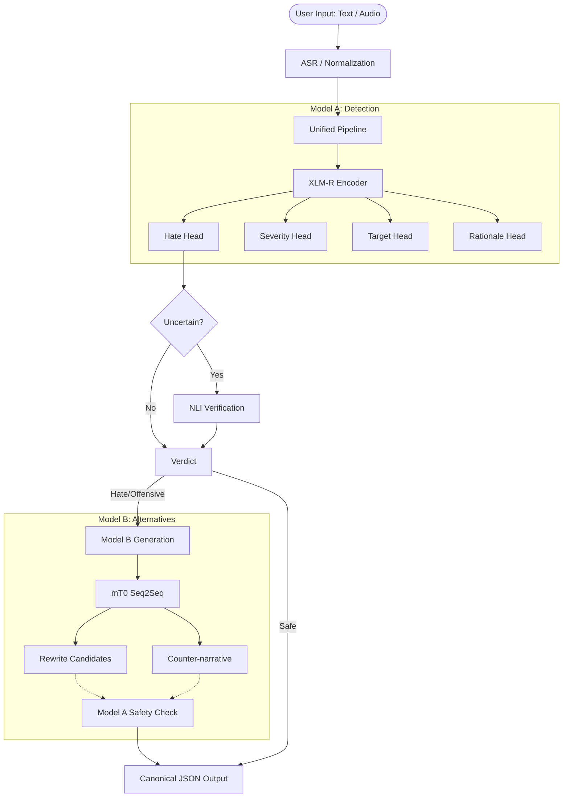

# Civitas AI

**Civitas AI** is a multilingual hate speech detector and counter-narrative generator designed for code-mixed Indic languages and English. It operates on text or speech, explains its decisions, and recommends alternate ways to communicate.

## Architecture



## Features

- **Multilingual Support**: English, Hindi, Tamil, Telugu, Malayalam, Roman Urdu.
- **Robust to Code-Mixing**: Built specifically to handle Indic-English code-mixing and leetspeak evasion.
- **Dual-Node Architecture**: Model A (detection) gates Model B (generation) to ensure safe output.
- **Explainability**: Highlights rationale spans and executes an NLI (Natural Language Inference) second-stage check for ambiguous phrases.

## Setup

### 1. Backend Server
```bash
python -m venv venv
source venv/bin/activate
pip install -r requirements.txt
make dev-api
```

### 2. Frontend Web UI
```bash
cd frontend
npm install
npm run dev
```

### 3. Docker (Production)
```bash
docker compose up -d
```

## Ethical Considerations & Limitations

- **Identity Mention False Positives**: While mitigated, the model may occasionally flag sentences that merely assert marginalized identities.
- **Human Review**: The UI is designed as a "Moderator View". The system highlights and suggests, but human review is always recommended for punitive actions.
- **Privacy**: The backend does NOT store raw audio by default (`STORE_RAW_AUDIO=0`).

For more details, see the Model Cards in `docs/`.
